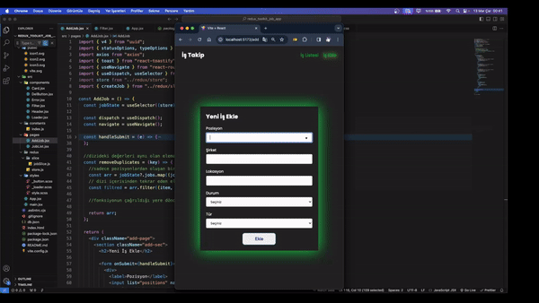

# İş Yönetim Sistemi

Bu proje, kullanıcıların iş listelerini yönetmelerine olanak tanıyan bir sistemdir. React.js kullanılmıştır. React Router, uygulama içindeki navigasyonu yönetmek için kullanılmıştır. Redux Toolkit, uygulamanın durum yönetimini sağlamak için tercih edilmiştir. Axios, HTTP isteklerini yönetmek için kullanılmıştır. JSON Server, sahte bir API sunucusu sağlar ve bu proje üzerinde yerel bir API sunucusu olarak kullanılmıştır.

## Özellikler:

- **İş Listeleme**: Kullanıcılar mevcut işleri listeleyebilirler.
- **İş Ekleme**: Kullanıcılar yeni iş listeleri ekleyebilirler.
- **Hata Yönetimi**: API istekleri sırasında karşılaşılan hatalar kullanıcıya nazikçe işlenir ve gösterilir.
- **Yükleme Göstergesi**: İş verileri getirilirken kullanıcılara görsel geribildirim sağlar.

## Kullanılan Teknolojiler:

- React
- React DOM
- React Icons
- React Router DOM
- React Redux
- Redux Toolkit
- Axios
- JSON Server
- React Toastify
- Sass
- UUID

## Ana Bileşenler:

- **App.js**: Uygulamanın ana bileşeni, rotaları ayarlar, Redux durum yönetimini ele alır ve API istekleri yapar.
- **Header**: Uygulamanın başlığını gösteren yeniden kullanılabilir bir bileşen.
- **JobList**: Mevcut işlerin listelendiği bileşen.
- **AddJob**: Yeni iş listesi eklemek için bir bileşen.

## Ekran Görüntüsü

